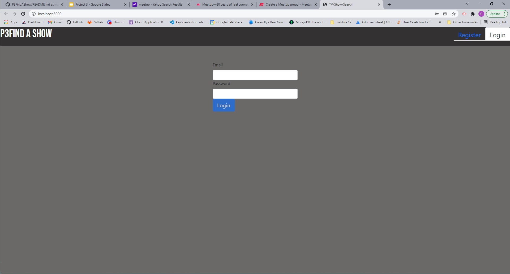
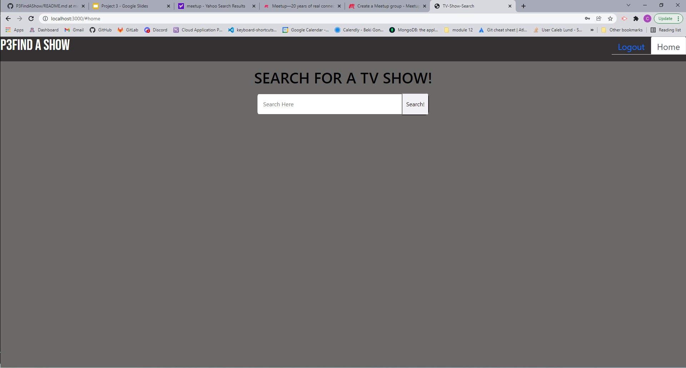

# projectThree

Purpose:
This is an app that people can gather informaion on different TV Shows. It will provide information in many aspects for each TV Show. Lets user gather information, leave or review comments from others.

Process:
* Signup/Login
* Search for desired TV show information
* Read descriptions and view images of search results
* Leave / Review comments/perspectives left from others

Tasks:
* Back end log-in and registering, back end comments, heroku, mongo, setting up pages, react displays, API functions and displays

Built with:
* CSS
* JavaScript
* Json
* html
* .gitignore
* bootstrap
* mongoose

Repo:
https://github.com/cclund444/P3FindAShow

Heroku:
https://powerful-shore-59524.herokuapp.com/#login

Powerpoint:
https://docs.google.com/presentation/d/1mBxvn6_yWMB91r_sZRkkRUX48Et7JJXTSipSQlCRGj0/edit?usp=sharing

Contributors:

Tyler Mair
(630) 740-9575
tyleramair@gmail.com
https://github.com/tmair1012

Alejandro Rosas
(480) 430-4301
Alejandromrosas@outlook.com
https://github.com/Alejandromrosas

Caleb Lund
(575) 937-3648
calebcoylund444@gmail.com
https://github.com/cclund444

